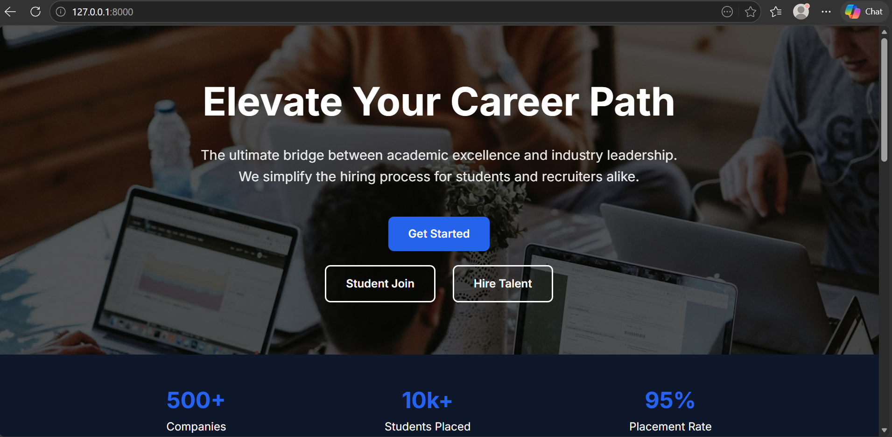
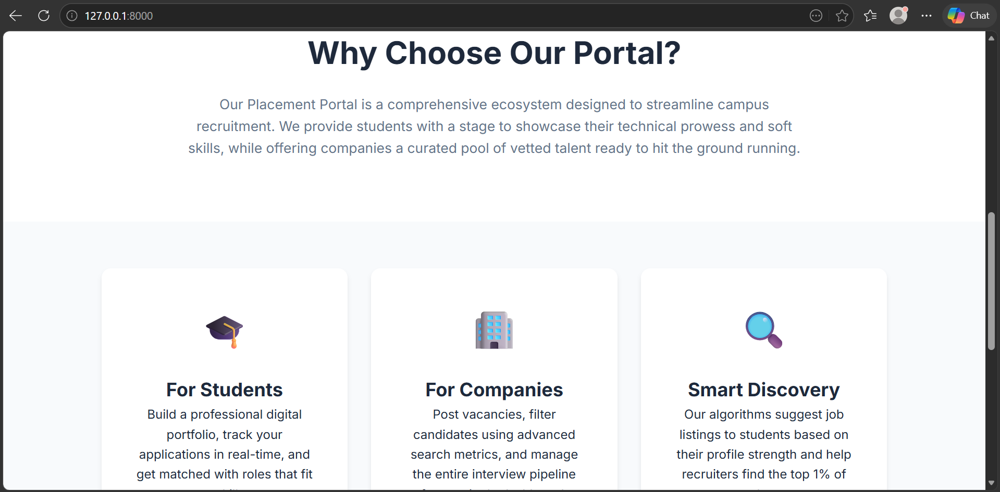
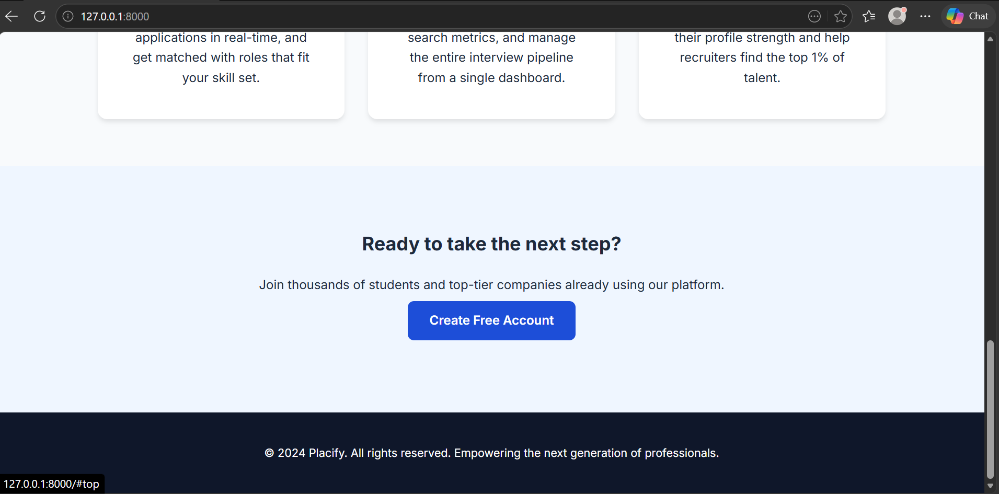
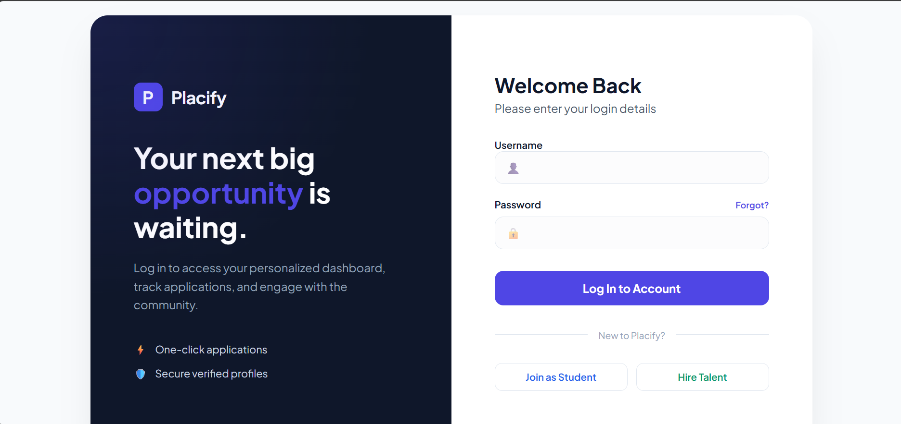
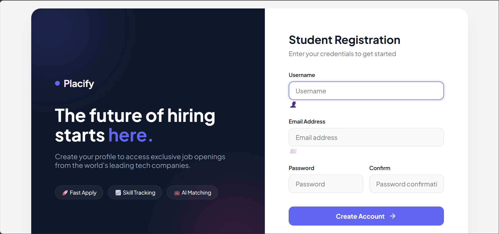
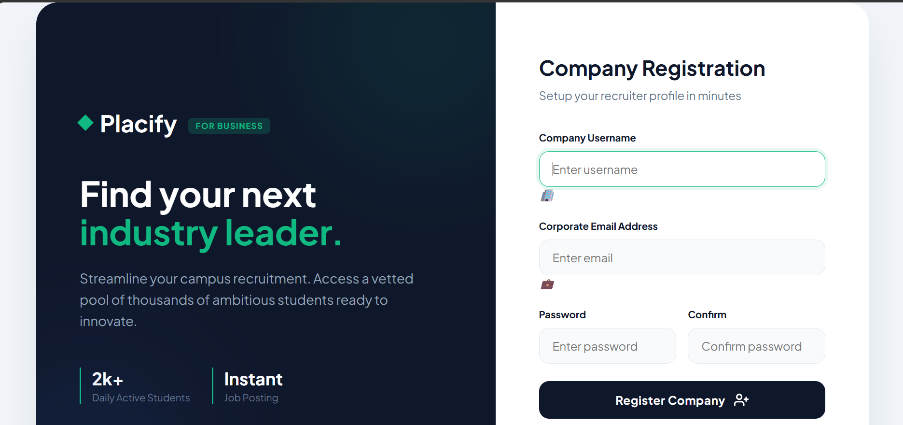
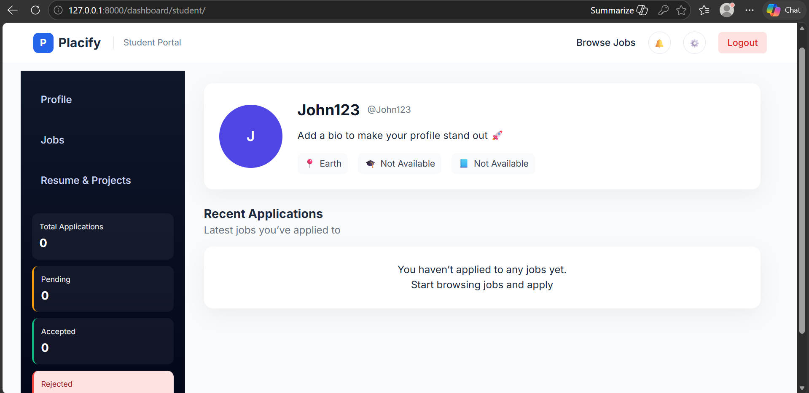
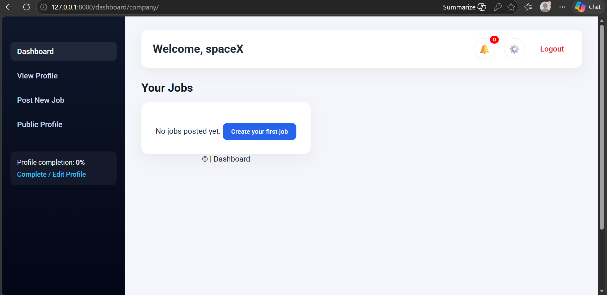

# 🚀 Placify – Placement Portal Web Application

Placify is a full-stack web application built using Django that helps manage the campus placement process. It connects students and companies on a single platform, making job applications and recruitment easier and more organized.

---

## 📚 Table of Contents

- [📌 Overview](#-overview)
- [✨ Features](#-features)
- [🛠️ Tech Stack](#-tech-stack)
- [📂 Project Structure](#-project-structure)
- [⚙️ Installation & Setup](#-installation--setup)
- [📸 Screenshots](#-screenshots)
- [🌟 Future Improvements](#-future-improvements)
- [📄 License](#-license)

---

## 📌 Overview

Placify provides a centralized system where:

- Students can explore job opportunities and apply easily  
- Companies can post jobs and manage applicants  
- The entire placement process becomes structured and transparent  

This project is designed to simulate a real-world placement portal used in colleges.

---

## ✨ Features

### 👨‍🎓 Student Panel

- User registration and login  
- Create and update profile (private/public)
- Upload resume  
- Browse all available jobs  
- View job details  
- Apply for jobs  
- Save and unsave jobs  
- Track application status
- view company public profile

---

### 🏢 Company Panel

- Company registration and login  
- Create and manage company profile  (private/public)
- Post new job openings  
- Edit job details  
- View all posted jobs  
- View applicants for each job
- view applicants public profile
- Update application status (Accepted / Rejected)  

---
### 👨‍🎓 Student Dashboard

The student dashboard provides a centralized interface for managing profile, job applications, and activity.

**Profile**
- View private profile  
- Edit / complete profile details  
- View public profile  

**Jobs**
- View applied jobs  
- View saved jobs  

**Resume & Projects**
- Upload and manage resume  
- Add and manage projects  

**Browse Jobs**
- Explore all available job opportunities

**Notifications**
- Receive updates about applications status and privacy edit
- 
**Settings**
- Manage account settings  

**Logout**
- Securely log out from the system
- 
### 🏢 Company Dashboard

The company dashboard provides tools to manage job postings, company profile, and recruitment activities.

**Profile**
- View company profile  
- Complete / update profile details  
- View public profile  

**Jobs**
- Post new job openings  
- View all posted jobs  
- Edit job details  
- Manage job listings  

**Applicants**
- View applicants for each job  
- Review candidate details  
- Update application status (Accepted / Rejected)  

**Notifications**
- Receive updates about applications and platform activity  

**Settings**
- Manage account settings  

**Logout**
- Securely log out from the system
- 
---

### 🔐 Authentication

- Role-based system (Student / Company)  
- Secure login and access control  

---

## 🛠️ Tech Stack

- **Backend:** Django (Python)  
- **Frontend:** HTML, CSS, javaScript
- **Database:** SQLite  
- **Others:** Django ORM, Template Engine  

---

## 📂 Project Structure
```bash
placementportal/
│── accounts/ # Authentication & user management
│── jobs/ # Job posting and job listing logic
│── applications/ # Job application workflow
│── profiles/ # Student & company profiles
│── dashboard/ # Role-based dashboards
│── notifications/ # Notification system
│── templates/ # HTML templates
│── static/ # CSS and static files
│── media/ # Uploaded files (resumes)
│── screenshots #screenshots of some of the pages.
│── manage.py # Django command utility

```

---

## ⚙️ Installation & Setup

Follow these steps to run the project locally on your system:

### 1️⃣ Clone the repository

```bash
git clone https://github.com/raquib-first/placify.git
cd placify
```
### 2️⃣ Create virtual environment
```bash
python -m venv venv
venv\Scripts\activate
```
### 3️⃣ Install dependencies
```bash
pip install -r requirements.txt
```
### 4️⃣ Apply migrations
```bash
python manage.py makemigrations
python manage.py migrate
```
### 5️⃣ Create Superuser (Admin Access)

```bash
python manage.py createsuperuser
```

### 6️⃣ Run Development Server

```bash
python manage.py runserver
```

👉 Open in browser:
http://127.0.0.1:8000/

---
## 📸 Screenshots

Below are some previews of the application:

### 🏠 Homepage




### Login


### 👨‍🎓 Student Registration


### 🏢 Company Registration


### 👨‍🎓 Student Dashboard


### 🏢 Company Dashboard


---

## 🌟 Future Improvements

Planned features and enhancements for the project:

* 📧 Email notifications for job updates
* 🤖 Resume parsing and skill extraction
* 🔍 Advanced job filtering & search
* 🌐 Deployment on cloud (Render / AWS)
* 📱 Responsive UI improvements
* 🔐 Enhanced security features

---

## 📄 License

This project is licensed under the MIT License.

You are free to use, modify, and distribute this software in accordance with the license terms.


